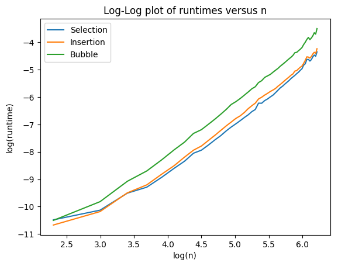
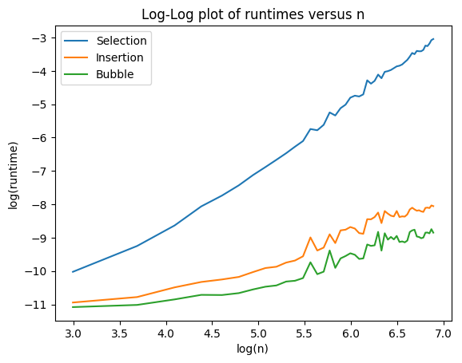
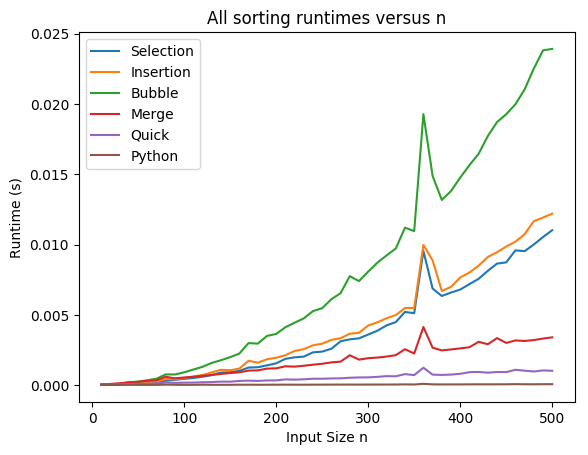
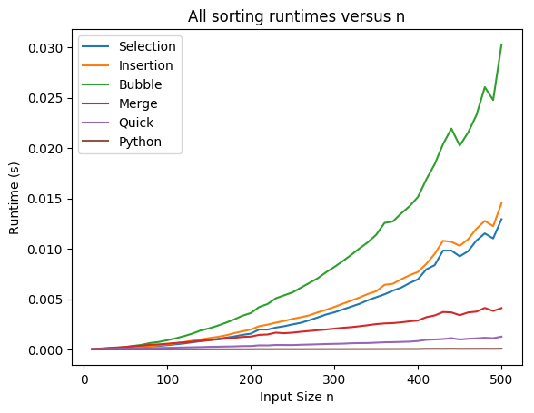
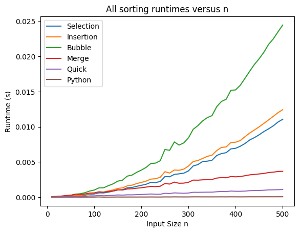

# Project Report 1: Sorting

Students Name and NetID: 

- Yifan Men(ym129)
- Yuqiao Liang(yl543)

## Selection Sort
<!---->

| Case | Time complexity |
| --- | :---: |
| Best | $O(n^2)$ |
| Average | $O(n^2)$ |
| Worst | $O(n^2)$ |

The main idea of selection sort that we have two array, one is sorted and the other is unsorted. We pick up the smallest element from the unsorted array and add it to the end of the sorted array. 

## Insertion Sort
<!---->

**Time complexity:**

| Case | Time complexity |
| --- | :---: |
| Best | $O(n)$ |
| Average | $O(n^2)$ |
| Worst | $O(n^2)$ |

The idea behind insertion sort is similar to selection sort. The difference is that in insertion sort, we pick the next element from the unsorted list instead of the smallest. Then we insert this element into the sorted array at the correct order(by ascending order). 

## Bubble Sort
<!---->

| Case | Time complexity |
| --- | :---: |
| Best | $O(n)$ |
| Average | $O(n^2)$ |
| Worst | $O(n^2)$ |

This algorithm requires iterations through the array. By comparing the pairs of numbers, it makes the the pairs in an ascending order. Keep doing so until no more swaps are made. For each pass, the $k$th largest element gets placed at the $k$th iteration. So we only need to iterate through the first $n-k$ elements at each pass.

## Merge Sort
<!---->

| Case | Time complexity |
| --- | :---: |
| Best | $O(nlogn)$ |
| Average | $O(nlogn)$ |
| Worst | $O(nlogn)$ |

It is a divide and conquer algorithm. This algorithm try to divide the array into two halves, so that the small part will be sorted. The base case of each subarray is 1-element or 2-element array. With two sorted subarray, it is easy to merge the two with a new array which is sorted.

## Quick Sort
<!---->

| Case | Time complexity |
| --- | :---: |
| Best | $O(nlogn)$ |
| Average | $O(nlogn)$ |
| Worst | $O(n^2)$ |

Quick sort use the divide and conquer philosophy. First we need to choose one element as pivot. Then partition the array into two parts. On the left is everything smaller than pivot, on the right is everything bigger than pivot. After each partition, we will recursively call the partition process. 

## Overall

### Testing Methodology

We do multiple test, and calculate the average value as the answer. In such a way, we can minimize environment-caused discrepancy.

We should also apply the algorithms to arrays with different length to test the performance. We take 30, 120, 1000 as test cases, though might not big enough with the real world data.

As the performance of each computer is different, it's reasonable to report the theoretical runtime. Once we calculate the expected runtime, we can compare it with the runtime we obtain to see if our algorithm is implemented correctly. Runtime for smaller values of n is not convincing. If we were running another application in the background, which will slow down the computer, we can have huge difference between the idle condition and the busy condition. 

### Best Case comparison

According to the left figure, all of Selection Sort, Insertion Sort, Bubble Sort run in the same big O of complexity(i.e. $O(n^2)$), when the array is not sorted. However, when it comes to a sorted array(the right figure), Selection Sort behaves the different way, this is because the other two has some optimization to this situation, avoiding useless iteration. 

What's more, the reason why bubble sort usually takes more time than the other two may because the swap takes more time, even it is $O(1)$ time complexity for each swap.

### Best Sorting Algorithm

Here we have several algorithms: Selection Sort, Insertion Sort, Bubble Sort, Merge Sort, Quick Sort, Python Built-in Sort. We compare these algorithms with 3-items array(the above figure), 30-items array(the middle figure) and 120-elements array(the below figure).

 

 

All of them behaves the same way. Although the worst case of Quick Sort is also $O(n^2)$, but it does not really happen in real situation, and it is also the fastest algorithm according to tests.

When we take the Python Built-in Sorting into consideration, there is no-doubt that it is always the best choice. According to Internet, it is a method called Timsort, which is a hybrid sorting algorithm, derived from merge sort and insertion sort, designed to perform well on many kinds of real-world data. 

